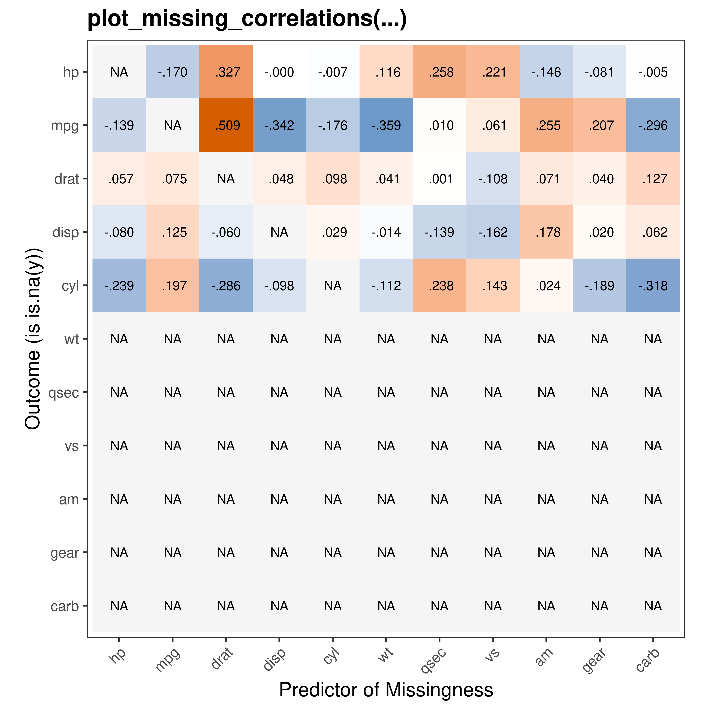
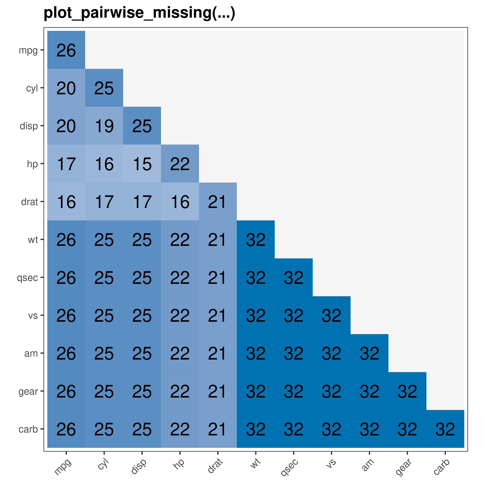
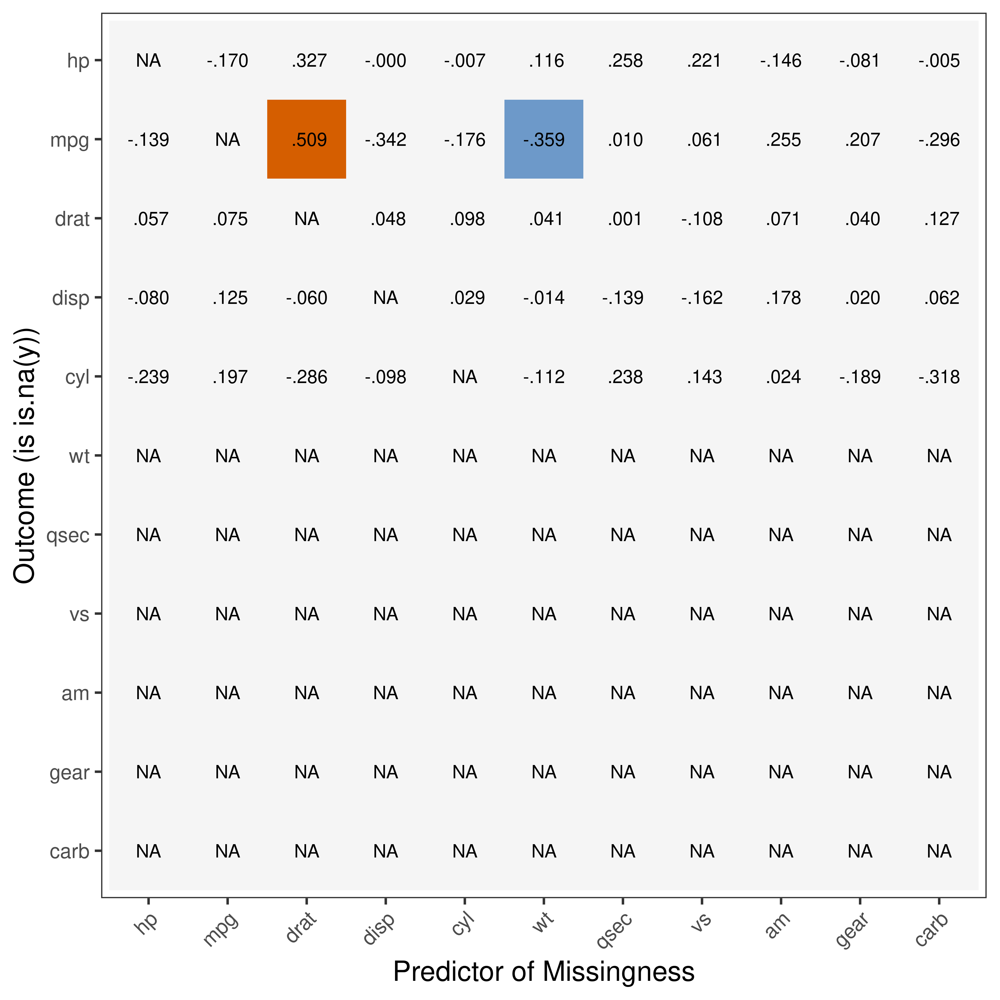

gbtools README
================

This vignette provides an overview of the plot_correlations and
plot_missing_correlations functions from the gbtools R package. These
functions are designed to visualize correlation matrices and explore
missing data correlations within a dataset. We’ll demonstrate how to use
these functions with example data and explain the insights they can
provide.

## Installation

The package is only available on github. To download, run the following:

``` r
# install.packages("devtools")

# devtools::install_github("giac01/gbtools")

library(gbtools)
```

## Example Data

We’ll use the built-in mtcars dataset.

To make things more realistic, we’ll add some missing data to this
dataset.

``` r
set.seed(10)

mtcars_missing = as.matrix(mtcars)

mtcars_missing[,1:5][runif(n = length(c(t(mtcars_missing[,1:5]))))>.7] <- NA

mtcars_missing = data.frame(mtcars_missing)
```

## plot_correlations(…)

You can combine standard ggplot2 commands with plot_correlation function
as shown below.

``` r
plot_correlations(mtcars_missing, textadjust = 1.7, suppress_warning_message = TRUE) + 
  ggplot2::labs(title = "Example plot_correlations",
                subtitle = "Lower Diagonal: correlations\nDiagonal: # non-missing observations for each variable\nUpper Diagonal: sample size for pairwise correlations and 95% CI"
                                          )
```

<!-- -->

## plot_missing_correlations(…)

plot_missing_correlations visualises how missingness in your dataset is
correlated with other variables in your dataset.

We transform each variable with missing data (in this case, only hp,
mpg, drat, disp and cyl have any missing data) into a vector of 1s
(missing) and 0s (not missing). We then compute pairwise correlations
with other variables in the dataset to calculate if missingness is
related to the other variables.

``` r
gbtools:::plot_missing_correlations(mtcars_missing, suppress_warning_message = TRUE)
```

<!-- -->

To illustrate what this is doing, consider the correlation highlighted
in orange above.

This represents the pairwise correlation between missingness in mpg and
drat.

``` r
cor.test(as.numeric(is.na(mtcars_missing$mpg)), mtcars_missing$drat)
```

    ## 
    ##  Pearson's product-moment correlation
    ## 
    ## data:  as.numeric(is.na(mtcars_missing$mpg)) and mtcars_missing$drat
    ## t = 2.5791, df = 19, p-value = 0.01839
    ## alternative hypothesis: true correlation is not equal to 0
    ## 95 percent confidence interval:
    ##  0.09938895 0.77135067
    ## sample estimates:
    ##       cor 
    ## 0.5092274

By default, only correlations with *p \< .05* are highlighted.

Changing the p-value threshold to NULL or 1 will avoid thresholding.

``` r
gbtools:::plot_missing_correlations(mtcars_missing, p_threshold_col = 1, suppress_warning_message = TRUE)
```

<!-- -->

This function is still in development, and will likely change over time.

## plot_pairwise_missing(…)

The diagonal shows the number of non-missing observations for each
variable

The lower diagonal shows the number of cases where rows are not missing
for a given pair of variables.

``` r
gbtools:::plot_pairwise_missing(mtcars_missing, suppress_warning_message = TRUE)
```

<!-- -->
