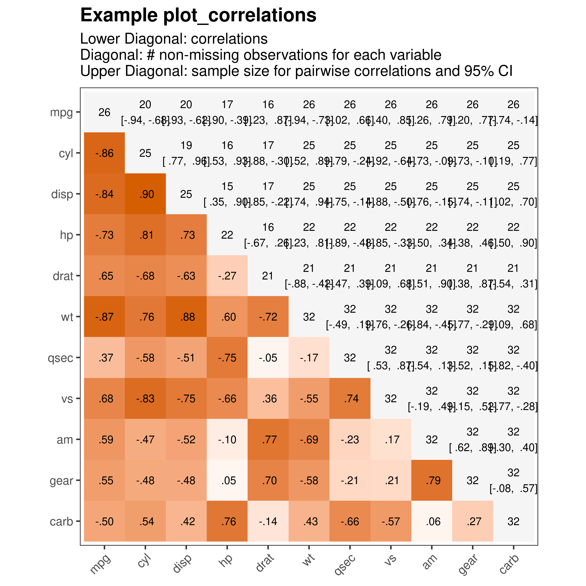
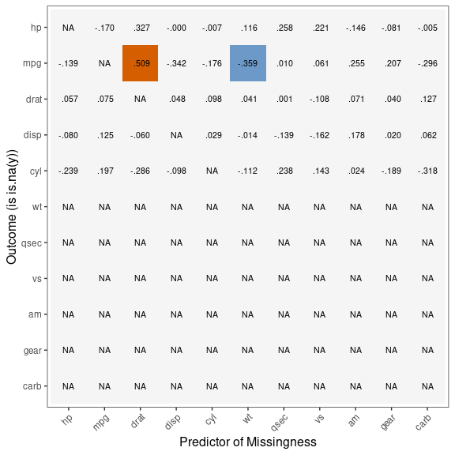
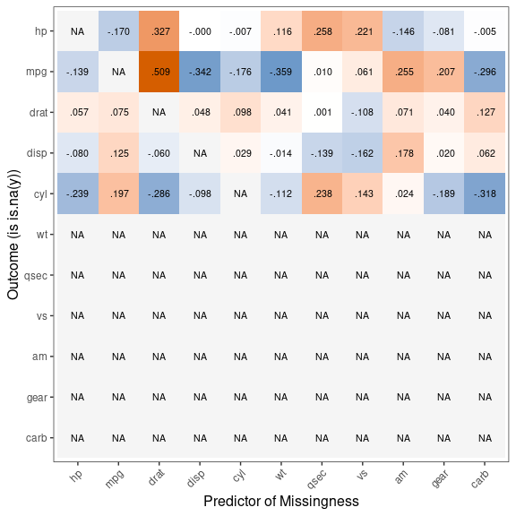
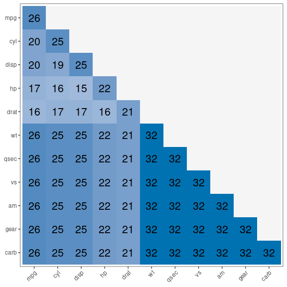

This vignette provides an overview of the plot\_correlations and
plot\_missing\_correlations functions from the gbtools R package. These
functions are designed to visualize correlation matrices and explore
missing data correlations within a dataset. We’ll demonstrate how to use
these functions with example data and explain the insights they can
provide.

## Installation

The package is only available on github. To download, run the following:

    # install.packages("devtools")

    devtools::install_github("giac01/gbtools")

    ## Downloading GitHub repo giac01/gbtools@HEAD

    ## These packages have more recent versions available.
    ## It is recommended to update all of them.
    ## Which would you like to update?
    ## 
    ## 1: All                             
    ## 2: CRAN packages only              
    ## 3: None                            
    ## 4: Rcpp   (1.0.10 -> 1.0.11) [CRAN]
    ## 5: digest (0.6.32 -> 0.6.33) [CRAN]
    ## 
    ## ── R CMD build ────────────────────────────────────────────────────────────────────────────────────────────────────────────
    ##      checking for file ‘/tmp/Rtmp1xMcwS/remotes398745d24355/giac01-gbtools-bef203a/DESCRIPTION’ ...  ✔  checking for file ‘/tmp/Rtmp1xMcwS/remotes398745d24355/giac01-gbtools-bef203a/DESCRIPTION’
    ##   ─  preparing ‘gbtools’:
    ##      checking DESCRIPTION meta-information ...  ✔  checking DESCRIPTION meta-information
    ##   ─  excluding invalid files
    ##      Subdirectory 'R' contains invalid file names:
    ##      ‘ignore.test’
    ##   ─  checking for LF line-endings in source and make files and shell scripts
    ##   ─  checking for empty or unneeded directories
    ##    Omitted ‘LazyData’ from DESCRIPTION
    ##   ─  building ‘gbtools_0.0.1.tar.gz’
    ##      
    ## 

    ## Installing package into '/usr/local/lib/R/site-library'
    ## (as 'lib' is unspecified)

    library(gbtools)

## Example Data

We’ll use the built-in mtcars dataset.

To make things more realistic, we’ll add some missing data to this
dataset.

    set.seed(10)

    mtcars_missing = as.matrix(mtcars)

    mtcars_missing[,1:5][runif(n = length(c(t(mtcars_missing[,1:5]))))>.7] <- NA

    mtcars_missing = data.frame(mtcars_missing)

## plot\_correlation function

You can combine standard ggplot2 commands with plot\_correlation
function as shown below.

    plot_correlations(mtcars_missing) + ggplot2::labs(title = "Example plot_correlations",
                                              subtitle = "Lower Diagonal: correlations\nDiagonal: # non-missing observations for each variable\nUpper Diagonal: sample size for pairwise correlations and 95% CI"
                                              )

    ## Warning in plot_correlations(mtcars_missing): This function is in development, and not yet ready for widespread use. 
    ##   Proceed with caution

## plot\_missing\_correlations function

plot\_missing\_correlations visualises how missingness in your dataset
is correlated with other variables in your dataset.

We transform each variable with missing data (in this case, only hp,
mpg, drat, disp and cyl have any missing data) into a vector of 1s
(missing) and 0s (not missing). We then compute pairwise correlations
with other variables in the dataset to calculate if missingness is
related to the other variables.

    gbtools:::plot_missing_correlations(mtcars_missing)

    ## Warning in gbtools:::plot_missing_correlations(mtcars_missing): This function is in early beta, and not yet ready for widespread use. 
    ##   Proceed with caution

To illustrate what this is doing, consider the correlation highlighted
in orange above.

This represents the pairwise correlation between missingness in mpg and
drat.

    cor.test(as.numeric(is.na(mtcars_missing$mpg)), mtcars_missing$drat)

    ## 
    ##  Pearson's product-moment correlation
    ## 
    ## data:  as.numeric(is.na(mtcars_missing$mpg)) and mtcars_missing$drat
    ## t = 2.5791, df = 19, p-value = 0.01839
    ## alternative hypothesis: true correlation is not equal to 0
    ## 95 percent confidence interval:
    ##  0.09938895 0.77135067
    ## sample estimates:
    ##       cor 
    ## 0.5092274

rmarkdown::render(“README.Rmd”, output\_format = “html\_document”) By
default, only correlations with p &lt; .05 are highlighted.

Changing the p-value threshold to NULL or 1 will avoid thresholding.

    gbtools:::plot_missing_correlations(mtcars_missing, p_threshold_col = 1)

    ## Warning in gbtools:::plot_missing_correlations(mtcars_missing, p_threshold_col = 1): This function is in early beta, and not yet ready for widespread use. 
    ##   Proceed with caution

This function is still in development, and will likely change over time.

## Plot Pairwise Missingness

The diagonal shows the number of non-missing observations for each
variable

The lower diagonal shows the number of cases where rows are not missing
for a given pair of variables.

    gbtools:::plot_pairwise_missing(mtcars_missing)

    ## Warning in gbtools:::plot_pairwise_missing(mtcars_missing): This function is in early beta, and not yet ready for widespread use. 
    ##   Proceed with caution

